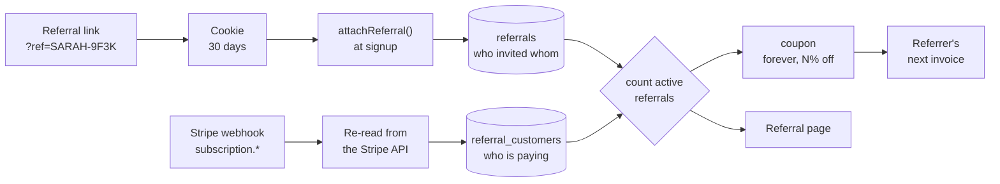

<div align="center">

# nextjs-stripe-referrals

**A referral program that pays out only when the referral actually pays.**

Every referral who becomes a paying customer takes a slice off the referrer's own
subscription. The moment they stop paying, that slice comes off the next invoice.
Drop-in for Next.js + Prisma + Stripe.

[](https://nextjs.org)
[](https://prisma.io)
[](https://stripe.com)
[](https://typescriptlang.org)
[](#what-is-tested-and-what-is-not)
[](#five-languages)
[](LICENSE)

[Quick start](#quick-start-60-seconds) · [Install it in your app](#install-it-in-your-app) ·
[Configuration](#configuration) · [Abuse](#abuse-and-why-this-design-resists-it) ·
[In production](#in-production-on-wwwasteriasapp)

</div>

---

## The idea

Most referral programs pay for a signup. A signup costs nothing to manufacture, so
those programs either get farmed or get wrapped in fraud rules nobody can explain.

This one pays for **revenue**, and only while the revenue lasts:

```
Sarah refers Tom  ──▶  Tom signs up          ──▶  Sarah earns nothing
                       Tom starts a trial    ──▶  Sarah earns nothing
                       Tom's card is charged ──▶  Sarah gets 20% off
                       Tom's card fails      ──▶  Sarah is back to full price
                       Tom pays again        ──▶  Sarah gets 20% off again
```

Five paying referrals and Sarah's subscription is free. The percentages and the cap
are yours to set in one `.env` file.

There is no points balance, no credit ledger, no payout queue. The discount is a pure
function of how many of your referrals are paying **right now**, recomputed from the
database and pushed to Stripe. Which means it cannot drift out of sync with what the
customer is shown, because both read the same function.



---

## In production on www.asterias.app

This is not a weekend abstraction. It runs the referral program of
**[Asterias](https://www.asterias.app)**, a paid SaaS.

> **[Asterias](https://www.asterias.app)** answers the Google reviews of local businesses,
> automatically. It reads new reviews as they land, writes a reply in the owner's own
> tone and in the reviewer's language, and publishes it. Anything sensitive, a one or
> two star review, a complaint about hygiene or safety, is held back and sent to the
> owner on Telegram or WhatsApp for a yes or no before it goes anywhere near the
> public listing. It is sold in France, the United Kingdom, Germany, Italy and Spain.
>
> **[See the product →](https://www.asterias.app)** · [Pricing](https://www.asterias.app/en/#pricing) · [How it works](https://www.asterias.app/en)

The version extracted here is not a copy of that code. It is a rewrite that fixes two
real defects found while extracting it, both documented below in
[what can go wrong](#what-can-go-wrong-and-what-this-does-about-it). If you are running
something similar, they are worth ten minutes of your time.

---

## Why this one

Three things go wrong in almost every hand-rolled Stripe referral program. This module
is mostly the shape of avoiding them.

<table>
<tr><th align="left" width="34%">The trap</th><th align="left">What happens</th><th align="left" width="26%">What this does</th></tr>
<tr>
<td><b>A <code>once</code> coupon</b></td>
<td>It looks like the tidy way to make "recalculated every month" true: attach a
single-use coupon, let it fall off, attach the next one. But now the discount depends
on something re-attaching it before <i>every single invoice</i>. Any window where that
did not run is a full-price charge, and nothing reports it.</td>
<td><code>duration: forever</code>. The discount is durable state that this module
removes deliberately. A late sync costs nothing.</td>
</tr>
<tr>
<td><b>Trusting the webhook payload</b></td>
<td>Stripe does not guarantee delivery order. A <code>past_due</code> event can arrive
after the <code>active</code> that replaced it. Write what the payload says and you
move a discount on a <i>third party's</i> subscription, based on a state that is no
longer true.</td>
<td>Every event triggers a fresh read of the Stripe API. Concurrent handlers are
ordered by their read timestamp.</td>
</tr>
<tr>
<td><b>Trusting the webhook at all</b></td>
<td>A deploy, a 500, an event Stripe stopped retrying: the referrer is on the wrong
tier and a wrong discount looks exactly like a right one.</td>
<td>A reconciler recomputes every tier from the database on a schedule, repairs
drift, and says what it repaired.</td>
</tr>
</table>

---

## Quick start (60 seconds)

```bash
git clone https://github.com/MaxenceLassus/nextjs-stripe-referrals
cd nextjs-stripe-referrals
pnpm install

docker compose up -d          # Postgres on :5433
cp .env.example .env.local    # works as-is without Stripe
pnpm db:migrate && pnpm db:seed
pnpm dev
```

Open <http://localhost:3000>. Without Stripe keys the program records and displays
referrals but applies no discount, and says so on screen. Add a test key and a webhook
secret to switch the billing half on.

**Play both sides in one browser:**

1. Sign up, open **Referrals**, copy your link.
2. Open the link in a private window and sign up as somebody else.
3. Subscribe the second account.
4. Look at the first account's referral page: 20% off, and the next invoice quoted.
5. Cancel the second subscription. Watch it come back off.

---

## Install it in your app

The whole module is one folder: **`src/referrals/`**. Copy it. Then three things.

### 1. Add the schema

Copy the four models from [`prisma/schema.prisma`](prisma/schema.prisma) (everything
below the `User` marker) into yours, and migrate.

They carry **no foreign key to your users table**. `userId` is an opaque string:
whatever your app calls an account id. That is what makes this a folder you copy
rather than a migration you merge. The trade is that nothing cascades on account
deletion, so call `forgetUser(userId)` from your own deletion path.

`src/referrals/db.ts` is a two-line Prisma singleton. Delete it and point the import at
the client you already have.

### 2. Attribute the account at signup

```ts
import { attachReferral, readReferralCookie, clearReferralCookie, accountLabel } from '@/referrals'

const user = await createYourAccount(...)          // whatever you already do

await attachReferral(user.id, await readReferralCookie(), {
  label: accountLabel({ name: user.name, email: user.email }),
})
await clearReferralCookie()
```

`attachReferral` **never throws**. A referral is a marketing nicety; a signup is the
business. A stale, mistyped, self-referring or forged code returns a result you may log
and ignore, and the account is created either way.

To catch `?ref=` on every page rather than only the signup form, add one line to your
existing middleware:

```ts
// src/middleware.ts
export function middleware(request: NextRequest) {
  return captureReferral(request, NextResponse.next())
}
```

People share the page that convinced them, which is the pricing page far more often
than it is `/signup`.

### 3. Mount the webhook, and tag your checkout

```ts
// src/app/api/referrals/webhook/route.ts
export { POST } from '@/referrals/stripe/webhook'
```

```ts
// wherever you create a Checkout session
const session = await stripe.checkout.sessions.create({
  mode: 'subscription',
  line_items: [{ price, quantity: 1 }],
  ...referralCheckoutOptions(user.id),   // <- binds the Stripe customer to the account
})
```

### And the page

```tsx
// src/app/dashboard/referrals/page.tsx
export default async function Page() {
  const user = await requireUser()      // your auth, not this module's

  return <ReferralPage
    userId={user.id}
    locale={user.locale}
    label={user.name}
    price={{ amount: 2900, currency: 'eur' }}   // optional: quotes the real next invoice
  />
}
```

`ReferralPage` takes a `userId` and never works out who is signed in, **on purpose**.
Authentication is yours. A component that resolved the session itself is a component
that can be mounted on a route where nobody checked.

---

## Configuration

Everything lives in `.env`, validated at boot. A configuration that cannot be honoured
**refuses to start** rather than failing on the day a customer earns the top tier.

| Variable | Default | What it does |
|---|---|---|
| `REFERRAL_PERCENT_STEP` | `20` | Percent off per paying referral. |
| `REFERRAL_MAX_REFERRALS` | `5` | How many referrals still earn one. |
| `REFERRAL_COUNT_TRIALING` | `false` | Whether a referral still in its free trial counts. **Read [abuse](#abuse-and-why-this-design-resists-it) before changing this.** |
| `REFERRAL_COUPON_PREFIX` | `referral_off` | Prefix for the coupons this app creates. The percentage is appended. |
| `REFERRAL_COOKIE_DAYS` | `30` | How long a captured code survives before signup. |
| `APP_URL` | — | Public origin. Referral links are built from it. |
| `STRIPE_SECRET_KEY` | — | Without it, referrals are tracked but no discount is applied. |
| `STRIPE_WEBHOOK_SECRET` | — | Without it, the endpoint rejects everything. Both are required for the billing half. |

`REFERRAL_PERCENT_STEP × REFERRAL_MAX_REFERRALS` must be **≤ 100**. Stripe has no coupon
above 100% off, and a tier that asks for one would silently fall through to *no discount
at all* for the account that earned the most.

```bash
20 × 5   # a referral is worth 20%, five make it free      (default)
10 × 5   # a gentler program that caps at half price
25 × 2   # two referrals, half price, nothing beyond
33 × 3   # 99% at the top; the last 1% keeps a card on file
```

---

## How the discount is computed

There is deliberately **no stored "current discount"**. The tier is a pure function of
how many referrals are paying at this instant:

```ts
discountPercent(activeReferrals) =
  min(max(activeReferrals, 0), MAX_REFERRALS) × PERCENT_STEP
```

The same function feeds the dashboard and the Stripe sync, so what a customer is shown
and what their card is charged cannot disagree by two places falling out of step.

**What counts:**

| Stripe status | Counts? | |
|---|:---:|---|
| `active` | ✅ | Paying. |
| `trialing` | ⚠️ | Only if `REFERRAL_COUNT_TRIALING=true`. |
| `past_due`, `unpaid` | ❌ | A renewal failed. This is what "stops at the first missed payment" means. |
| `canceled` | ❌ | |
| `paused` | ❌ | |
| `incomplete`, no subscription, free plan | ❌ | Never paid anything. |

**When it changes:** on the referred account's `checkout.session.completed`,
`customer.subscription.*`, `invoice.paid` and `invoice.payment_failed` — and on the
reconciler's schedule, whether or not any of those arrived.

**When the customer feels it:** on their **next invoice**. Discount changes are written
with `proration_behavior: 'none'`, so a tier change never generates a credit note or an
immediate charge for a month already served. The page says this in all five languages.

### One thing to know about the top tier

At 100% off, Stripe issues a €0 invoice and **does not charge the card**. Two
consequences worth designing for:

- The card stops being exercised. When the tier later drops to a paying one, that first
  real charge can fail on a card that expired months ago, and the account goes
  `past_due`.
- Going from free back to paying should not be a surprise. The referral page quotes the
  next invoice for exactly this reason. Consider an email too.

If that bothers you, `33 × 3` caps at 99% and keeps a real charge on the account.

---

## Abuse, and why this design resists it

The single most important line in this module is that **a trial does not count**.

With trials counted, anyone opens five accounts, starts five trials, takes 100% off
their own subscription and cancels all five before a card is ever touched. The program
pays out for nothing.

With trials excluded, earning a discount requires real subscriptions to be really paid
for. To fake five paying referrals you must genuinely pay for five subscriptions in
order to make one free. **The economics do the policing**, which is why there is no
fraud-scoring heuristic here to tune or to explain to a support ticket.

The rest of the surface:

| Attack | Why it fails |
|---|---|
| Referring yourself | `resolveReferrer` refuses when the code's owner is the new account. |
| Two referrers for one account | `referredUserId` is unique. First one wins, forever. |
| Forging the cookie or the `?ref=` value | Both are visitor-controlled and neither is trusted: the code is looked up in the database at signup. Forging one only ever *gives* a discount to the account named, so there is nothing to steal. |
| Claiming referrals retroactively | `attachReferral` refuses an account that has already been a customer. |
| Replaying a Stripe webhook | Every event id is recorded before handling; the primary key drops the replay. |
| Posting to the webhook URL directly | No valid signature, no handling. Without `STRIPE_WEBHOOK_SECRET` the endpoint refuses everything rather than trusting anything. |
| Reading another account's referrals | Every query is keyed on the `userId` you pass. Pass an authenticated one. |
| Harvesting your friends' email addresses | The referrer sees the `label` you stored, not an email. `maskEmail()` is the default when you have nothing better. |

**What is left to you:** rate-limit your signup route. This module cannot see your
traffic, and account creation is your endpoint.

---

## What can go wrong, and what this does about it

Honest failure modes, because a referral bug is a billing bug and billing bugs are
quiet.

<details>
<summary><b>The webhook endpoint was down during a deploy</b></summary>

Stripe retries for up to three days, so most events arrive late rather than never. For
the ones that do not, the reconciler recomputes every tier from the database and repairs
the difference. Run it hourly.
</details>

<details>
<summary><b>Stripe rejected the discount write</b></summary>

`syncDiscountFor` never throws — throwing would fail a webhook that was really about
somebody's payment and make Stripe retry everything in it. The reason is written to
`referral_customers.lastSyncError`, the reconciler retries it on the next pass whatever
the arithmetic says, and **the referral page shows the discrepancy to the customer**
rather than letting them find it on an invoice.
</details>

<details>
<summary><b>Two webhooks handled at the same time</b></summary>

Both re-read the Stripe API, and the read timestamp travels with the data. A write
whose read is older than what is already stored is dropped.
</details>

<details>
<summary><b>Someone hand-made a coupon with a colliding id</b></summary>

`ensureCoupon` refuses to use a coupon whose `percent_off` is not the one it asked for,
rather than silently discounting by an amount nobody configured. Change
`REFERRAL_COUPON_PREFIX`.
</details>

<details>
<summary><b>You changed REFERRAL_PERCENT_STEP</b></summary>

Stripe coupons are immutable, so the percentage is part of the coupon id
(`referral_off_25`). Changing the setting asks for a coupon that does not exist yet and
gets a correct one. Existing subscriptions move to the new tier at their next sync;
`pnpm referrals:reconcile` moves them all now.
</details>

<details>
<summary><b>A referred account was deleted</b></summary>

Nothing cascades, by design. Call `forgetUser(userId)` from your deletion path: it
removes the rows and resyncs the referrer, who was earning a discount for an account
that no longer exists.
</details>

<details>
<summary><b>You apply coupons to the Stripe customer as well</b></summary>

This module writes *subscription-level* discounts and clears only those. A coupon on the
Stripe **customer** is inherited by their subscriptions and is not this module's to
remove. If you use both, they stack.
</details>

---

## Operations

```bash
pnpm referrals:doctor              # is this deployment actually going to apply discounts?
pnpm referrals:reconcile           # repair drift; run hourly
pnpm referrals:reconcile --dry-run # report it without writing
pnpm referrals:verify-flow         # walk the whole program against a real database
```

**`doctor`** answers, from the server, the question that has no answer in a browser:
a missing webhook secret, a key pointing at the wrong Stripe account, a coupon with the
wrong duration. Every one of those looks, from outside, exactly like a program where
nobody has referred anybody yet.

```
Configuration
  ok    tiers: 20% x 5 = 100% maximum
  ok    trials do not count
Stripe
  ok    key works: account acct_1234 (Your Company)
  ok    mode: test
Coupons
  ok    referral_off_20: 20% off, forever
  FAIL  referral_off_40 has duration "once", not "forever".
        A `once` coupon falls off after one invoice and the discount silently stops.
```

**`reconcile`** only speaks when it did something. A sweep that logs on every quiet run
trains everyone to ignore it, and then the noisy day gets missed too. If it is repairing
twenty discounts a day, something upstream is broken and you need to know.

---

## Five languages

English, French, German, Italian, Spanish. English is the default and the fallback for
anything unrecognised; `fr-CA` resolves to `fr`.

The dictionaries are typed as `Record<ReferralLocale, ReferralCopy>`, so adding a
language, or adding a string, **fails to compile** until every language has it. A test
also asserts that no translation drops a `{placeholder}` and that no string contains an
em dash. Pass whatever your users table stores:

```tsx
<ReferralPage userId={user.id} locale={user.locale} />
```

---

## API reference

<details>
<summary><b>Everything exported from <code>@/referrals</code></b></summary>

**Signup**
| | |
|---|---|
| `attachReferral(userId, code, { label })` | Attribute an account. Never throws. |
| `forgetUser(userId)` | Remove an account from the program and resync its referrer. |
| `captureReferral(request, response)` | Catch `?ref=` in your middleware. |
| `readReferralCookie()` / `clearReferralCookie()` | The captured code. |

**Reading**
| | |
|---|---|
| `referralSummary(userId)` | Count, earned percent, applied percent, cap, period end. |
| `listReferrals(userId)` | One row per referral, with status and whether it counts. |
| `countActiveReferrals(userId)` | The number the discount is computed from. |
| `ensureReferralCode(userId, label)` | Mint or return the account's code. |

**Stripe**
| | |
|---|---|
| `referralCheckoutOptions(userId)` | Spread into your Checkout session creation. |
| `refreshSubscriptionState(userId)` | Read Stripe and make everything follow. |
| `syncDiscountFor(userId)` | Recompute one account's tier and write it. |
| `reconcile(options)` | The drift sweep. |

**Rules (pure)**
| | |
|---|---|
| `discountPercent(n)` · `discountedAmount(amount, percent)` | The arithmetic. |
| `referralLink(code, path)` · `referralCodeBase(name)` | The link and the code format. |
| `maskEmail(email)` · `accountLabel({ name, email })` | What the referrer is shown. |

**UI** — `<ReferralPage>`, `<ReferralTable>`, `<CopyLink>`, `getReferralDictionary(locale)`

</details>

---

## What is tested, and what is not

**89 unit tests**, no database and no network. They cover the tier arithmetic and its
clamps, code minting and escaping, config validation, status mapping, the attribution
guards, webhook signature/idempotency/routing, and the discount sync including its
failure path.

**8 of those are wire tests**: the real Stripe SDK, serializing real parameters, against
a local recorder. They assert the bytes, not a mock — `duration=forever` on the coupon,
`discounts[0][coupon]` when applying, `discounts=` (empty) when removing,
`proration_behavior=none` on both. These are the three things most likely to be silently
wrong in a Stripe integration and invisible to a mocked test.

**`pnpm referrals:verify-flow`** walks the whole program against a real Postgres: 25
assertions covering minting, attribution, self-referral, retroactive attribution,
counting, trials, payment failure, recovery, cancellation and deletion.

**Not covered by any of it:** how Stripe actually responds, and whether a real invoice
comes out lower. That needs a live test key and five minutes:

```bash
stripe login
stripe listen --forward-to localhost:3000/api/referrals/webhook   # copy the whsec_ into .env.local
pnpm referrals:doctor                                             # confirm the key and the coupons
# then: subscribe account B, check account A's coupon in the Stripe dashboard,
# cancel B, check it is gone, and read the upcoming invoice on A.
```

---

## FAQ

<details>
<summary><b>Can the referred person get a discount too?</b></summary>

Not out of the box. A discount to the referred account is given *before* they have paid
anything, which is the one thing this design deliberately avoids: it is granted on a
promise rather than on evidence, and it is the only real abuse vector in the whole
system. If you want it anyway, apply your own coupon at checkout; nothing here will
interfere.
</details>

<details>
<summary><b>Does it work with multiple currencies or plans?</b></summary>

Yes. The discount is a percentage, so it is currency-agnostic and plan-agnostic. The
optional `price` prop on `ReferralPage` is only for quoting the next invoice.
</details>

<details>
<summary><b>Does it need the webhook?</b></summary>

Yes, and unlike a subscription's own provisioning this is not negotiable. A referral's
billing change has to reach an account that is *not* the one looking at the screen.
Nobody is watching, so there is no lazy refresh to fall back on.
</details>

<details>
<summary><b>Does it work without Stripe?</b></summary>

It runs, records referrals and displays them, and says on screen that no discount is
being applied. Useful for local development and for a deployment whose Stripe setup is
not finished.
</details>

<details>
<summary><b>My app is not Next.js.</b></summary>

The rules, codes, queries, Stripe sync, webhook handler and reconciler are plain
TypeScript with no framework in them. Only `capture.ts`, `middleware.ts` and `ui/` are
Next-specific, and they are about a third of the folder.
</details>

<details>
<summary><b>Why not one npm package?</b></summary>

Because the two things you most need to install are a Prisma model and an App Router
page, and npm cannot deliver either without you copying them anyway. A folder is honest
about that.
</details>

---

## License

MIT. See [LICENSE](LICENSE).

If you ship it, [say hello](https://www.asterias.app) — I would like to know it was useful.
